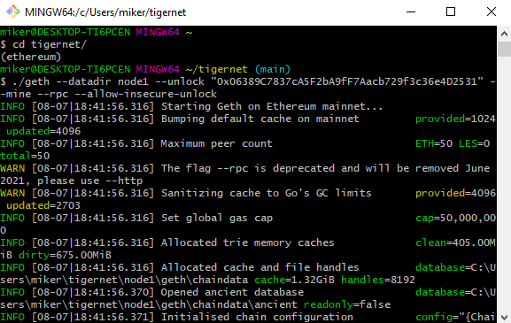
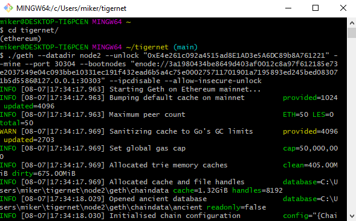
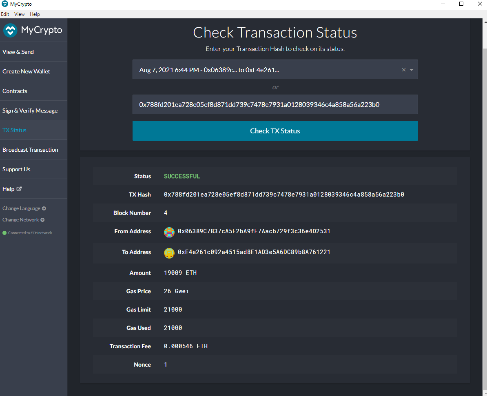
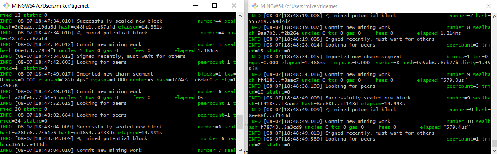
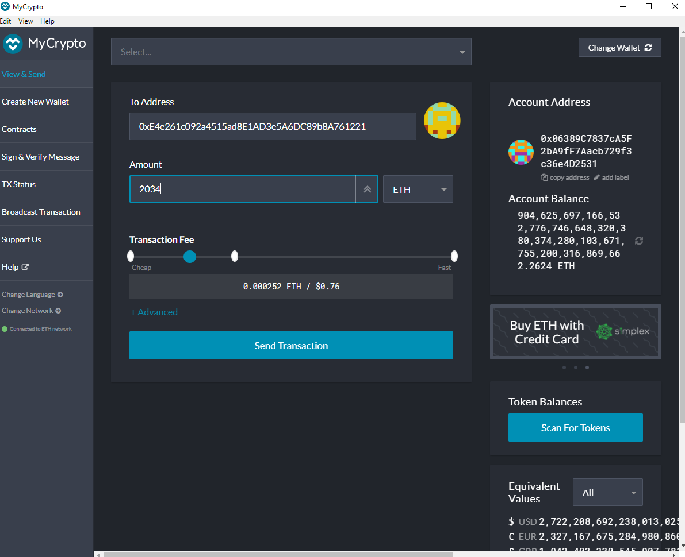
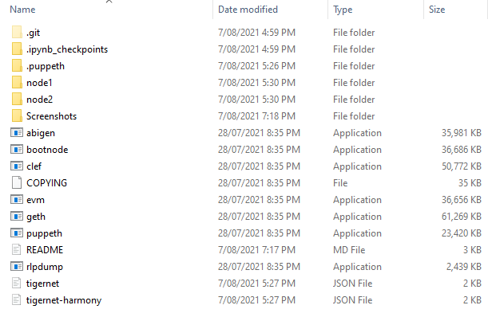

# Unit 18 ZBank Blockchain: "tigernet" 

Setting up the blockchain to run:

See notes below each node on lines of code to run and enter password.

Node 1 is set up to do the mining whereas Node 2 is set up to do validation of the blocks.

## Key Network information:
Network Name: Tigernet

Chain ID: 500

Custom Network setup on MyCrypto: tigernet

Git Bash: Use 'ethereum' environment including appropriate installs

For local files use blockchain tools - GETH (Go Ethereum)

MyCrypto is used for the test transaction PoC, however this could be another platform such as MetaMask.

Network set up as Proof of Authority (PoA)

Blocktime set as default (15 seconds)

## Node 1
Public address of the key:   0x06389C7837cA5F2bA9fF7Aacb729f3c36e4D2531

Path of the secret key file: node1\keystore\UTC--2021-08-07T07-05-43.005008000Z--06389c7837ca5f2ba9ff7aacb729f3c36e4d2531
self=enode://3a1980434be8649d403af0012c8a97f612185e73e2037549e04c093bbe10331ec191f432ead6b5a4c75e000275711701901a7195893ed245bed083071b5d5586@127.0.0.1:30303

*leaving in path of secret key file for the purpose of the this unit and testnet only

### Line of code to run:
./geth --datadir node1 --unlock "0x06389C7837cA5F2bA9fF7Aacb729f3c36e4D2531" --mine --rpc --allow-insecure-unlock

*password: will need to be entered straight after deploying above line of code

## Node 2
Public address of the key:   0xE4e261c092a4515ad8E1AD3e5A6DC89b8A761221

Path of the secret key file: node2\keystore\UTC--2021-08-07T07-06-54.869005600Z--e4e261c092a4515ad8e1ad3e5a6dc89b8a761221
self=enode://1d45de151708a7b42ca6fd6736d7b4a340b1d7466b07dffba13724f096c852065872b4ab247830b240a118b5de6cb3af04992e6697666205d8d502e5376b0fbf@127.0.0.1:30304

*leaving in path of secret key file for the purpose of the this unit and testnet only

### Line of code to run:
./geth --datadir node2 --unlock "0xE4e261c092a4515ad8E1AD3e5A6DC89b8A761221" --mine --port 30304 --bootnodes "enode://3a1980434be8649d403af0012c8a97f612185e73e2037549e04c093bbe10331ec191f432ead6b5a4c75e000275711701901a7195893ed245bed083071b5d5586@127.0.0.1:30303" --ipcdisable --allow-insecure-unlock

*password: will need to be entered straight after deploying above line of code

## Additional set up information:
MyCrypto set up as main wallet for this exercise

Node setup via Git Bash using GETH and puppeth executed using CLI

For sending a transaction custom network created called 'tigernet' and chain ID added as 500 (since that was the number chosen on set up)
From 'View and Send', Node 1 wallet connected to MyCrypto (which connects the private key and allows access to this wallet and holdings)
Node 2 public address added as recipient then transaction sent. Visually could see this was added to Node 1 block and validated on Node 2.

--mine : enables the node to mine new blocks. This flag is set on the first node ONLY
--miner.threads <value> : tells geth how many CPU threads (aka. "workers") to use during mining. The default
value is 0. Since our example isn't that difficult to mine (when using a PoW consensus algorithm), we can set it to 1
    
--port : specifies the network's listening port. The default value is 30303 , but since the first node's sync port
already took up 30303 , we need to change the port number for our second node

In Microsoft Windows, we need to add the flag --ipcdisable due to the way Windows spawns new IPC/Unix
sockets doesn't allow for having multiple sockets running from geth at once. Since we are only using HTTPRCP / WS-RCP , we can safely disable the IPC sockets.    

* credit to Claudia Dong for some of the above comments/ definitions :)
    
Puppeth, to generate your genesis block

Geth, a command-line tool, to create keys, initialize nodes, and connect the nodes together

Example successful transaction:

Mining at work:

Preparing to send cryto from Node 1 wallet to Node 2 public address:

Main files:

